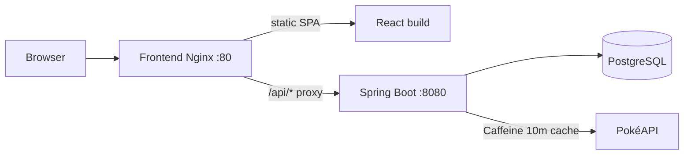

# Pokémon Platform

Full-stack interview deliverable: browse PokéAPI data, sync selected Pokémon into PostgreSQL, and manage proprietary local fields behind JWT auth.

| Layer | Stack |
|-------|--------|
| Backend | Java 21, Spring Boot 4.1, Maven, Flyway, Caffeine, JWT |
| Frontend | React 19, TypeScript, Vite |
| Data | PostgreSQL 16 |
| Ops | Docker Compose (Postgres + API + Nginx SPA) |

## Quick start (recommended)

```bash
cp .env.example .env   # optional; defaults work for local demo
docker compose up --build
```

| Surface | URL |
|---------|-----|
| Web UI | http://localhost |
| API (direct) | http://localhost:8080 |
| Health | http://localhost:8080/actuator/health |

Stop with `docker compose down`. Persist DB with the named volume `pokemon_pg_data` (`docker compose down -v` wipes it).

## Demo credentials

Seeded on backend startup (`DemoUserSeeder`):

| Email | Password | Role |
|-------|----------|------|
| `admin@example.com` | `password123` | `ADMIN` (sync + delete) |
| `demo@example.com` | `password123` | `USER` (read/update proprietary fields) |

Registration is available via `POST /api/v1/auth/register` (API-only; the UI ships a login flow). New accounts receive the `USER` role.

## Architecture



Clean Architecture packages under `com.sauldaniel.pokemon`:

- `domain` — models, ports, exceptions (no Spring/JPA/HTTP)
- `application` — use cases
- `adapter.in.web` — controllers, DTOs, RFC-style error handler
- `adapter.out.persistence` — JPA + Flyway
- `adapter.out.pokeapi` — RestClient + Caffeine
- `config` — security, JWT, cache, CORS

Public browse/detail read **live PokéAPI** (cached). Sync upserts into PostgreSQL; proprietary fields (`localizedName`, `region`, `internalNotes`, `tags`) live only in the local DB and are preserved across re-sync.

## API examples

```bash
# Browse (public)
curl 'http://localhost:8080/api/v1/pokemon?page=0&size=5'

# Detail (public)
curl 'http://localhost:8080/api/v1/pokemon/bulbasaur'

# Register / login
curl -s -X POST http://localhost:8080/api/v1/auth/login \
  -H 'Content-Type: application/json' \
  -d '{"email":"admin@example.com","password":"password123"}'

# Sync into local DB (ADMIN)
TOKEN=... # accessToken from login
curl -X POST "http://localhost:8080/api/v1/pokemon/1/sync" \
  -H "Authorization: Bearer $TOKEN"

# List / patch local roster (USER or ADMIN)
curl http://localhost:8080/api/v1/local/pokemon \
  -H "Authorization: Bearer $TOKEN"

curl -X PATCH "http://localhost:8080/api/v1/local/pokemon/<uuid>" \
  -H "Authorization: Bearer $TOKEN" \
  -H 'Content-Type: application/json' \
  -d '{"localizedName":"Fushigidane","region":"Kanto","internalNotes":"Starter","tags":["starter","favorite"]}'
```

| Method | Path | Auth |
|--------|------|------|
| `GET` | `/api/v1/pokemon?page=&size=` | Public |
| `GET` | `/api/v1/pokemon/{idOrName}` | Public |
| `POST` | `/api/v1/auth/register` | Public |
| `POST` | `/api/v1/auth/login` | Public |
| `POST` | `/api/v1/pokemon/{pokeApiId}/sync` | `ADMIN` |
| `GET` | `/api/v1/local/pokemon` | JWT |
| `GET` | `/api/v1/local/pokemon/{id}` | JWT |
| `PATCH` | `/api/v1/local/pokemon/{id}` | JWT |
| `DELETE` | `/api/v1/local/pokemon/{id}` | `ADMIN` |

## Local development (without full Compose UI)

**Backend only** (Compose Postgres + API):

```bash
docker compose up --build postgres backend
```

**Frontend Vite** (hot reload):

```bash
cd frontend
cp .env.example .env   # VITE_API_BASE_URL=http://localhost:8080
npm install
npm run dev            # http://localhost:5173
```

**Backend on the host** (Java 21):

```bash
cd backend
./mvnw spring-boot:run
```

## Tests

```bash
# Backend (unit + integration; Testcontainers with Zonky fallback)
cd backend && ./mvnw test

# Frontend
cd frontend && npm test
```

## Configuration

See [`.env.example`](.env.example). Non-secret knobs (ports, CORS origins, PokéAPI base URL, empty `VITE_API_BASE_URL` for same-origin Nginx) are safe to commit as examples. Set `JWT_SECRET` and `POSTGRES_PASSWORD` for anything beyond local demo.

Compose builds:

- `backend/Dockerfile` — multi-stage Maven → Temurin 21 JRE, Actuator healthcheck
- `frontend/Dockerfile` — Node 22 build → Nginx Alpine serving `dist/`, proxies `/api` to backend

## Trade-offs

| Choice | Why | Cost |
|--------|-----|------|
| Live PokéAPI for public browse/detail | Matches “cards from PokéAPI” UX without requiring a full sync first; Caffeine (10m) cushions latency | Offline/cold-start depends on PokéAPI availability; local DB is for synced/proprietary data |
| Package-based Clean Architecture (single module) | Clear dependency rule without multi-module Maven overhead for interview scope | Harder to enforce boundaries than separate JARs; discipline + reviews required |
| HS256 JWT (shared secret) | Simple ops for Compose demo | Rotate via env; prefer asymmetric keys / IdP for production |
| Nginx reverse-proxy SPA | One browser origin; no CORS friction for Docker UI | API still exposed on `:8080` for curl/tools; CORS kept for Vite/dev |
| Tags as constrained set | Predictable filtering/validation | Less free-form than arbitrary strings |
| Demo passwords in seeder | Fast interviewer walkthrough | Must change for any shared deployment |

## GenAI workflow

See [`docs/genai-workflow.md`](docs/genai-workflow.md) for how GenAI was used on this exercise (prompts, verification, accept/reject criteria).
